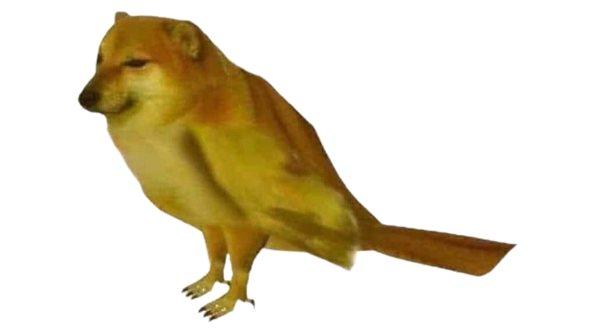

<h1 align="center">birmd</h1>

  <!--  -->
  
  <!--  -->
  
  

i don't know i'm just a birmd

---

## What is this?

This is a project was originally built as an internal joke, but RNNs turned out to be much more enjoyable through it. This project uses Character-based RNNs using the awesome [textgenrnn](https://github.com/minimaxir/textgenrnn) module, trained on the common names of around 11k birds to generate a new bird name.

Wow such awesome!

Creating and training RNN models is fairly easy with textgenrnn. The architecture used here is 3-layered character-level bidirectional RNN with 128 LSTM cells in each layer. It was trained using GPUs on [this Google Colab](https://colab.research.google.com/drive/1TbHIok9WCVlTznDwtsDaJM1vpjUXK5bT?usp=sharing). Then, the weights were saved locally and are used to generate a new bird name on each new request.

## Dataset

The datatset used for creating the training examples is scraped from [List of birds by common names](https://en.wikipedia.org/wiki/List_of_birds_by_common_name).

## Notes

If you want to be surprised by what RNNs can do, do check out Andrej Karapathy's blog on [The Unreasonable Effectiveness of Recurrent Neural Networks](https://karpathy.github.io/2015/05/21/rnn-effectiveness/). It's a really great read.

## Todo

-   [x] Create the initial model
-   [ ] Add a slider to adjust the temperature

## Thanks

Thanks to [Ashutosh Singh](https://github.com/thecodepapaya) for being an inspiration and a birmd figure for this project. And [Harsh Kakani](https://github.com/Harshkakani) for his constant support in making sure Ashutosh remains a birmd figure.
